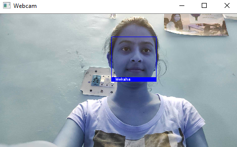

# Face-Detection

An Automatic facial recognition system  
It is designed for schools and colleges to record attendance. We can execute this on a computer that is connected directly with the CCTV Camera of the classes.  
Also, we can use this to find lost people or criminals using the CCTV Camera of a city. To execute on city Camera, we can feed a photo of wanted people/criminals as training data on the system. As that person will get detected, it will send a command to execute the alert siren.  
In this project, I have created a Facial recognition System with high accuracy. It can detect using eyes if a face is covered. Using this system, we can recognize faces using webCam and record them live in an excel sheet.

## SCREENSHOTS :

 
